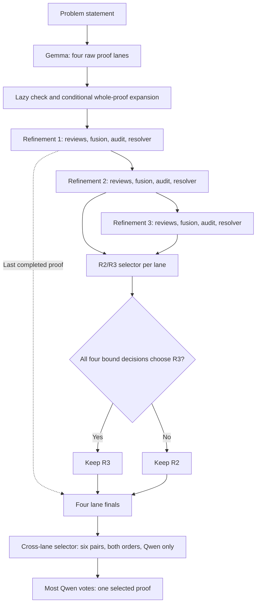

# TrinitySM: Towards IMO Gold with Small Language Models — A Harness for Extended Reasoning and Proof Refinement

## Motivation and impact

**Our primary goal is to test how far extended reasoning and a carefully designed
harness can improve the mathematical proof performance of small language models
by building on their native reasoning capabilities, without additional
post-training.**

**TrinitySM, the harness in this repository, scored 29/42 on the six IMO 2026
problems — equal to the gold-medal cutoff under automated grading.** It runs two
open-weight models served locally, Gemma 4 31B and Qwen3.6 27B, and combines
additional inference-time computation with structured review and revision. For
each problem it works in four independent lanes and submits one proof, chosen
without access to grades or reference solutions.

**IMO 2026**

| | Average | **Selector@1** | Oracle@4 |
|---|---:|---:|---:|
| Score (of 42) | 24.75 | **29** | 29 |

- **Average:** the mean score of the four lanes, i.e. what one lane scores on
  average.
- **Selector@1:** the one proof per problem that TrinitySM submits.
- **Oracle@4:** the best lane, known only after grading. A ceiling, not a
  submission.

The current harness uses Qwen-only final selection. Reported selector scores
are computed by re-tallying archived Qwen comparisons from runs that recorded
both models' votes; the generated proofs and grades are unchanged.
[Selections and comparison](docs/results/qwen_selection_20260928/README.md).

[Official 2026 cutoffs](https://www.imo-official.org/editions/2026/):
**gold 29**, silver 23, bronze 16.

**IMO-ProofBench**

| | Average | **Selector@1** | Oracle@4 |
|---|---:|---:|---:|
| Basic (30) | 78.13% | **82.38%** | 82.62% |
| Advanced (30) | 39.25% | **50.00%** | 52.38% |

**Our results suggest that high-level mathematical reasoning may not always
require very large foundation models.** On the tasks studied here, smaller,
locally served models produced stronger proofs when supported by a carefully
designed harness. This opens the possibility that sophisticated reasoning can
become more widely accessible through better use of available model capabilities.

Proof generation and refinement can already run locally without calls to hosted
inference APIs. **The longer-term vision is to bring strong mathematical and
logical reasoning to everyday devices: mobile phones and robots that reason
on device to support decision-making, situational awareness and understanding.**

The practical contribution is a reproducible approach to improving proof quality
with available local models. The release includes the complete harness,
generated proofs and grading evidence so others can examine and extend the
results.

[Qwen selection results](docs/results/qwen_selection_20260928/README.md) ·
[Original IMO 2026 evidence](docs/results/imo2026_b112_selection_20260922/README.md) ·
[Original ProofBench evidence](docs/results/proofbench_b112_final_20260926/README.md) ·
[How it works](#how-it-works) ·
[Reproduce](#setup-and-reproduction) ·
[Full report](docs/public_release_report.md) ·
[Sources and papers](docs/sources.md)

## How it works

TrinitySM turns a problem statement into one submitted proof. Gemma 4 31B
drafts, reviews and revises proofs; Qwen3.6 27B adds a second model's review and
audits each proposed acceptance or repair. Qwen chooses which final lane proof
to submit.



1. **Draft.** Gemma writes four independent proofs per problem, at two
   temperatures with two seeds each (`t07_r01`, `t07_r02`, `t10_r01`,
   `t10_r02`). The drafting prompt adapts the multi-persona dialectic prompting
   of [Dang et al. (v2, Appendix F.2)](https://arxiv.org/abs/2602.16793v2). A
   lazy check then flags omitted derivations, and the whole proof is expanded
   when needed.
2. **Refine, three times.** Separate reviews (two from Gemma, one from Qwen)
   find weaknesses, Gemma fuses them, Qwen audits the proposed acceptance or
   repair, and the resolver revises the proof. Extended reasoning has the
   models continue past a first answer and then write a complete replacement.
3. **Keep R2 or R3.** Gemma and Qwen compare each lane's second and third
   refinements (R2, R3) in both orders. R3 replaces R2 only if all four
   decisions choose it.
4. **Select across lanes.** The four lane finals are compared in all six pairs,
   in both orders, by Qwen: 12 votes. The proof with the most votes is
   submitted; ties follow a recorded seed-derived order.

New runs use Qwen-only final selection on both one-GPU and two-GPU layouts.
The run records and captures this selector policy for subsequent resumes.
The tables below re-tally saved Qwen votes over the archived lane finals and
their existing grades. Original selection records remain in the evidence
bundles. Existing runs retain their saved selector. The R2/R3 audit in step 3
still uses both models.

No stage sees reference solutions, grading guidelines or external grades. If a
stage fails, the lane keeps its last completed proof.

Small controlled tests showed that Gemma and Qwen have different strengths in
diagnosis and repair, which is why TrinitySM uses both; see the
[mixed-model rationale](docs/mixed_model_rationale.md).

## Benchmark results

### IMO 2026

<!-- BEGIN LATEST SELECTOR RESULTS -->
| Problem | Average | Selector@1 | Oracle@4 |
|---|---:|---:|---:|
| P1 | 7 | 7 | 7 |
| P2 | 3.75 | 4 | 4 |
| P3 | 1.5 | 2 | 2 |
| P4 | 5 | 7 | 7 |
| P5 | 4.5 | 6 | 6 |
| P6 | 3 | 3 | 3 |
| **Total (of 42)** | **24.75** | **29** | **29** |

[Qwen selections and archived proof grades](docs/results/qwen_selection_20260928/README.md)
<!-- END LATEST SELECTOR RESULTS -->

### IMO-ProofBench

<!-- BEGIN FINAL PROOFBENCH RESULTS -->
| Set | Problems | Proofs | Average | Selector@1 | Oracle@4 |
|---|---:|---:|---:|---:|---:|
| Basic | 30 | 119/120 | 78.13% | 82.38% | 82.62% |
| Advanced | 30 | 118/120 | 39.25% | 50.00% | 52.38% |
| Combined | 60 | 237/240 | 58.69% | 66.19% | 67.50% |

Three proofs are missing and are left out of the averages. The selector chose a
best-scoring proof, or one tied with it, on 52 of 60 problems, and never chose a
0–1 proof when a 6–7 proof was available.

[Qwen selections and comparison with the archived results](docs/results/qwen_selection_20260928/README.md) ·
[SCORECARD.json](docs/results/qwen_selection_20260928/SCORECARD.json)
<!-- END FINAL PROOFBENCH RESULTS -->

## Grading

Every proof is graded twice, in two independent calls to the same external
grader, gpt-5.6-sol at reasoning effort xhigh. The reported score is the mean of
the two grades. Each call sees one problem, its reference solution, the rubric
and one proof. None of TrinitySM's own reviews or earlier scores are passed in,
and the launcher disables tools, skills and project instructions for each
grading call, then checks the log for one completed turn and no tool calls
before accepting a grade. Grading is a separate step that the harness never
starts. This is automated grading, not official IMO jury marking.

| Benchmark | Rubric | Scores | Scorer |
|---|---|---|---|
| IMO-ProofBench Basic and Advanced | [IMOBench ProofAutoGrader B.5](docs/public_release/grading/README.md), with the official per-problem guidelines | 0, 1, 6, 7 | [score_proofbench.py](scripts/score_proofbench.py) |
| IMO 2026 | This project's [strict Olympiad v2](docs/public_release/grading/strict_olympiad_policy_v2.txt) | 0–7 | [score_imo_v2.py](scripts/score_imo_v2.py) |

- **B.5** labels a proof Incorrect (0), Partial (1), Almost (6) or Correct (7).
  We apply the published rubric with our own grader, so this does not reproduce
  the paper's Gemini 2.5 Pro evaluator or its human grades.
- **Strict v2** grades each proof as written, without filling gaps from the
  reference. It separates wrong answers, false statements, missing arguments and
  incomplete quantifier coverage, and caps unsupported central steps at 3.
- **ProofBench percentages** are the mean score divided by 7, with every problem
  weighted equally.
- **References** are the IMO-ProofBench dataset's solutions and, for IMO 2026,
  third-party solutions by the MechMath team. The MechMath text is not included
  in this repository; see [reference sources and rights](docs/sources.md).

Both scorers, the grading skills they came from and the wrapper that grades a
completed run are included. To grade your own run, see
[grading a completed suite](docs/local_reproduction.md#grade-a-completed-sampled-suite).

## Model selection

**We chose Gemma 4 31B and Qwen3.6 27B mainly to limit contamination risk.**
Both were released months before IMO 2026, which took place on 15–16 July 2026:
Gemma 4 on 2 April 2026 and Qwen3.6 27B on 21 April 2026. This lowers the risk
that the contest's problems or solutions were in their training data, but does
not rule it out; we have not audited either model's training corpus. The same
precaution does not cover IMO-ProofBench, whose problems were public before both
releases. The
[model-selection notes](docs/models.md#model-selection-and-contamination-risk)
give the sources and limits of this rationale.

## Setup and reproduction

### Environment

TrinitySM runs on either two GPUs or one. Our experiments used both layouts:
IMO 2026 on two GPUs, and IMO-ProofBench partly on two and partly on one.

| | Recorded setup |
|---|---|
| GPUs | NVIDIA RTX PRO 6000 Blackwell, 96 GB; two GPUs, or one with the models taking turns |
| Models | [Gemma 4 31B](https://huggingface.co/google/gemma-4-31B-it) with its MTP assistant, and [Qwen3.6 27B](https://huggingface.co/Qwen/Qwen3.6-27B), at pinned revisions; BF16 weights, no quantization |
| Serving | vLLM 0.24.0, 4-token MTP speculative decoding, thinking enabled |
| Python | 3.11.15 |
| Time | 1.5–2.2 hours to generate one IMO 2026 problem on two GPUs |

This is the setup we used, not a minimum requirement. The
[environment record](ENVIRONMENT.md) has the full hardware and software
details, and [models and downloads](docs/models.md) lists the pinned revisions.

### Reproduce the results

**1. Check the published results.** These commands check every hash and
recompute every published score and selection exactly from the saved proofs,
grades and votes. They do not re-grade the proofs. No GPU, model weights or
credentials are needed; Python 3.9 or later is enough.

```bash
git clone https://github.com/trinitylabs-ai/trinitysm.git
cd trinitysm
python3 -B docs/public_release/verify_scores.py
python3 -B scripts/verify_latest_selection.py
python3 -B scripts/export_proofbench_final.py --verify
python3 -B scripts/report_qwen_selection.py --verify
```

**2. Generate new proofs** on Linux with Python 3.11. Both layouts run the same
frozen generation engine and pinned model checkpoints, with the Qwen-only
final selector captured separately for each new run.

| Layout | Hardware | How the models run |
|---|---|---|
| Two GPUs | 2 × 96 GB GPUs | One model per GPU |
| One GPU | 1 × 96 GB GPU, about 128 GB RAM, local SSD | The models take turns; the idle one sleeps in CPU memory |

```bash
python3.11 scripts/setup_environment.py --install --download-models

# Two GPUs
python3 scripts/local_servers.py start --gemma-gpu 0 --qwen-gpu 1
python3 scripts/reproduce.py generate --benchmark imo2026 --run-id my_imo2026_run

# One 96 GB GPU
python3 scripts/local_servers.py start --single-gpu 0 --timeout 1800   # loading both models takes longer
python3 scripts/run_single_gpu.py --benchmark imo2026 --run-id my_imo2026_run

python3 scripts/local_servers.py stop
```

The models download from Hugging Face; log in or set `HF_TOKEN` first if the
provider requires it. Without selection filters, `--benchmark all` runs all
66 problems (IMO 2026 and both ProofBench sets). The single-GPU runner also
supports explicit problem IDs or per-set sampling counts. Its proofs are saved
under `benchmarks/<benchmark>/results/<run-id>_<problem-id>/generation/run/proofs/`;
the ordinary reproduction runner uses `<run-id>` without the problem suffix.
Omitted generation-seed options preserve the recorded fixed settings. GPU
generation and fresh grading can vary, so new proofs and scores may differ.
See the [standalone single-GPU check](docs/single_gpu_check.md) for flexible
problem selection, background execution and separate two-pass grading.

**3. Grade them.** Grading needs an authenticated `codex` CLI with access to
gpt-5.6-sol / xhigh, and the reference solutions, which are downloaded
separately. The [local reproduction guide](docs/local_reproduction.md) explains
how to grade a run.

## Future work

Producing one proof currently takes 1.5–2.2 hours and a large number of
generated tokens. Our goal is to make TrinitySM **faster and lighter**.

The hardest problems also remain unsolved. When a proof starts along the wrong
trajectory, the models find it hard to leave it, so **recovering from a wrong
initial direction** needs improvement.

We see five directions:

1. **Escaping reasoning traps:** in our runs, the small models were good
   verifiers that caught flaws in mathematical rigor, but they were weaker at
   exploring new directions or generating a solution trajectory. We want to
   detect when a proof is stuck on a wrong trajectory and steer it out, for
   example by directing each extended-reasoning continuation to challenge the
   current strategy or try another approach, instead of a fixed
   "Wait. Continue…" instruction.
2. **Faster inference:** NVFP4 quantization, optional extended reasoning, and
   deterministic tools for calculations and checks.
3. **Better selection:** close the remaining gap to Oracle@4, and predict proof
   quality so that apparently complete proofs can stop early.
4. **More effective tool use:** better claim selection and formalization, and a
   mathematical formal language that compiles claims into exact checks.
5. **Retrieval of similar examples:** search an external mathematical database
   for similar problems and proofs, and use them to choose a promising proof
   direction from the start.

Our longer-term ambition is to build small models with strong reasoning and
verification skills that run on local and edge devices. The
[future-work discussion](docs/public_release_report.md#future-work) describes
the proposed evaluations.

## License and sources

The original project code uses the [CC BY-NC 4.0 license](LICENSE): sharing
and adaptation are permitted for noncommercial purposes with attribution,
subject to the [license terms](https://creativecommons.org/licenses/by-nc/4.0/).
Copied datasets, grading text and model configuration files retain their own
terms in [NOTICE](NOTICE). Problem origins, dataset hashes and cited papers are
listed in [Sources and papers](docs/sources.md).

This public copy removes internal work notes, raw logs, personal paths and
internal network addresses; [the sanitization record](docs/reproduction/sanitization.md)
lists the changes. Submitted proof text and reported score values are
preserved.

## Acknowledgments

We thank the [International Mathematical Olympiad Association](https://www.imo-official.org/organisation/),
the host organizers and problem setters for the IMO competition and its problems.
We also thank [Google DeepMind and the IMO-Bench contributors](https://github.com/google-deepmind/superhuman/tree/main/imobench)
for the benchmark dataset and grading methodology, and the authors of the
[cited papers](docs/sources.md#papers-and-method-references) for their research.

## Appendix

- **A. [Ablation study](docs/public_release_report.md#ablation-study--imo-proofbench):**
  raw generation versus the full harness, on IMO-ProofBench and IMO 2026.
- **B. [Repository guide](docs/repository_guide.md):** where the harness,
  benchmarks, evidence and reports live.
- **C. [Tool calls (experimental)](docs/public_release_report.md#experimental-tool-call-results):**
  early trials of an optional exact-check extension, run on proofs from earlier
  runs.
