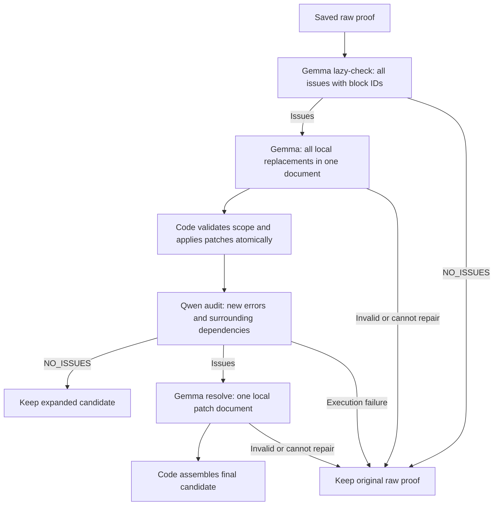

# Block-local repair after raw generation

This independent experiment reuses saved **raw drafts**, before lazy-check or
refinement. It stops after the new completion stages: Refinement 1–3 are not
run. The released harness, selector and post-final-proof experiment are unchanged.



## Edit contract

The host assigns `B0001`, `B0002`, … to paragraphs without splitting protected
math/code environments. It records exact UTF-8 byte offsets and source hashes.
Lazy-check returns the **complete issue list**, naming target blocks and missing
claims. The host authorizes those targets plus **one immediate neighboring block
on each side**. Expansion sees the full proof but returns only replacement
blocks in one document; issues are not repaired in separate model calls.

The code rejects stale sources, unknown IDs, unauthorized ranges, overlapping
patches, missing issues, malformed framing and empty replacements. It validates
all patches before applying them together. Unchanged spans and separators are
copied directly from the source bytes. Ambiguous math segmentation fails safely.

Qwen audits the patched proof with original changed passages and repair
obligations, prioritizing newly introduced errors and broken dependencies.
Gemma resolves audit issues once, with the same restrictions on a fresh block
map of the intermediate proof. Restoring originally valid text is allowed.
`CANNOT_REPAIR_LOCALLY` or stage failure retains the exact raw draft and records
a fallback. Intermediate candidates remain saved. There is no second audit loop;
the final candidate is evaluated by separate grading.

## Original chat extended reasoning

All four roles preserve the previous **reasoning and answer**, then request one
complete replacement response using a role-specific continuation. For repair
roles, that response is a **patch document**, not the whole proof. The first extended reasoning
response is never applied; the final accepted patch is applied only once.

| Role | Model | Continuation focus |
| --- | --- | --- |
| Lazy-check | Gemma | Recheck gaps, exact claims and block targets; withdraw invalid objections |
| Expansion | Gemma | Establish missing claims while preserving neighboring and downstream uses |
| Audit | Qwen | Find errors introduced by edits and test each objection against the proof |
| Resolve | Gemma | Fix audit defects, including restoring original valid material |

The comparison runs **block repair at 0.7, block repair at 0.4, then original
expansion at 0.4**, using the same frozen raw proofs and seed namespace:

| Stage | Block `t07` | Block `t04` | Original `original_t04` |
| --- | --- | --- | --- |
| Lazy-check, including extended reasoning | 0.1 | 0.1 | 0.1 |
| Expansion, including extended reasoning | 0.7 | 0.4 | 0.4 |
| Qwen audit, including extended reasoning | 0.2 | 0.2 | — |
| Gemma resolve, including extended reasoning | 0.7 | 0.4 | — |

The two block conditions differ only in expansion/resolve temperature. The
original control reuses the frozen lazy-check, whole-proof expansion and shared
extended reasoning continuation unchanged, with a process-local expansion temperature override
to **0.4**. It has no new block restrictions, audit or resolve. The released
harness's default temperature remains unchanged.

Exact instructions are in [prompts.py](../harnesses/block_local_completion/prompts.py).
The experiment imports frozen **1.7.0** transport/extended reasoning helpers read-only and accepts
native raw sources from pinned 1.7.0 or 1.8.0 runs. Source identities are retained.
Gemma uses inherited lazy/repair caps and sampling settings; Qwen uses inherited
audit settings. All request parameters, seeds, responses and extended reasoning evidence are
saved. Existing protocol/cap/timeout recovery can add physical calls beyond the
one logical stage. **All four lanes run concurrently in each stage**; conditional
stages batch the lanes that need them, without serializing eligible lanes or
adding unnecessary calls. A phase finishes before the next phase starts. There
are at most four logical stages per lane in the block conditions and two in
the original control. The new seed namespace is `block-local-raw:<seed>:<problem-id>`
(default seed 0); raw-generation seeds are preserved, not redrawn.

## Server inputs and execution

The public IMO archive has final proofs and some historical manifests, but not
all native raw/lazy traces. Supply the server's real **generation/run** directory.
The loader binds `draft_proof.md` to `cold_result.json`, the statement, source
release, candidate ID, generation text and seeds. It never substitutes a
`checked_proof.md` or final proof for a missing raw draft.

Expected raw path inside the native run:

```text
problems/imo2026_pN/01_source/pN/01_raw_lazy_enhanced_resolve/
  phase_1_raw_lazy/pN/candidates/<lane>/draft_proof.md
  phase_1_raw_lazy/pN/candidates/<lane>/cold_result.json
```

Use `--problem-id` repeatedly for a subset, or `--all` for six IMO problems.
Every selected problem needs four raw drafts. Repeat `--source-run` for disjoint
problem sets. Later lazy/refinement completion is not required.
Use native runs in their original locations: producer receipts contain absolute
proof paths. The standard IMO catalog numbering is required; custom problem
folders that renumber problems are not accepted.

First run model-free preflight from the repository root:

```bash
git pull --ff-only
WORKSHOP_RAW_SOURCE="/absolute/path/to/native/generation/run"
WORKSHOP_BLOCK_CHECK="raw_block_check_$(date +%Y%m%d_%H%M%S)"
.venv-solver/bin/python -B scripts/run_block_local_completion.py compare \
  --source-run "$WORKSHOP_RAW_SOURCE" --all \
  --output-dir ".workshop/experiments/$WORKSHOP_BLOCK_CHECK"
```

After `preflight_passed`, with both pinned model servers ready, use a fresh
directory for inference. Do not restart previously stopped experiments.

```bash
WORKSHOP_BLOCK_RUN="raw_block_repair_$(date +%Y%m%d_%H%M%S)"
mkdir -p .workshop/experiments
nohup .venv-solver/bin/python -u -B scripts/run_block_local_completion.py compare \
  --source-run "$WORKSHOP_RAW_SOURCE" --all \
  --output-dir ".workshop/experiments/$WORKSHOP_BLOCK_RUN" --execute-models \
  > ".workshop/experiments/$WORKSHOP_BLOCK_RUN.log" 2>&1 < /dev/null &
echo $! > ".workshop/experiments/$WORKSHOP_BLOCK_RUN.pid"
tail -n 50 -F ".workshop/experiments/$WORKSHOP_BLOCK_RUN.log"
```

For one problem replace `--all` with `--problem-id imo2026_p4`. Endpoint defaults
are Gemma `http://127.0.0.1:8030/v1`, Qwen `http://127.0.0.1:8027/v1`.
Ctrl-C on `tail` stops log viewing only. Sending TERM to the saved PID terminates
the controller's owned worker group, records interruption and leaves model
servers untouched. Do not edit experiment code during a run. No overwrite or
resume mode is provided.

`compare` freezes all three input sets before any model call, completes block
0.7 for all selected problems, then block 0.4, then original 0.4.
`pair_plan.json` records all three child plans; `paired_status.json` tracks the
active arm. Child results are under `t07/`, `t04/` and `original_t04/`.
For a single-condition diagnostic, use `run --repair-temperature 0.7`,
`run --repair-temperature 0.4`, or
`run --strategy original --repair-temperature 0.4` instead. The comparison
order is fixed and recorded, not randomized.

## Separate grading

After **all three conditions** finish generation, the reporter replays the
block conditions' saved patch chains and validates the original control's
saved response/output bindings before exporting opaque submissions in the parent
`grading/input_manifest.json`. It exports each original raw proof and each
distinct final proof for **two passes**, deduplicating exact proof bytes within
the same problem and grading configuration across all three conditions. Raw baselines are
graded once in two passes, and unchanged finals reuse those grades. This is
at most **192 judgments** for all 24 raw drafts and three conditions: 48 for
raw baselines and up to 144 for changed final proofs, before exact deduplication.
Historical B final-proof grades do not apply; B is neither regenerated nor
regraded. This first experiment does not import historical raw scores.

The recorded protocol is Strict Olympiad v2, `gpt-5.6-sol`, `xhigh`, with the
existing rubric/reference hashes and canonical problem binding. Keep
`grading_key.json` outside grader inputs. The runner does not launch a hosted
grader: unattended orchestration must separately run grading and import results.

For the paired export, return JSON schema `block-local-paired-grades-v1`, with a `rows` array containing exactly
two rows per exported submission. Fields: `submission_id`, `pass_index` (1 or 2),
integer `score` (0–7), `proof_file_sha256`, `model`, `reasoning_effort`,
`policy_sha256`, `reference_sha256`. Preserve raw grading responses as evidence.

```bash
.venv-solver/bin/python -B scripts/run_block_local_completion.py compare-report \
  --plan ".workshop/experiments/$WORKSHOP_BLOCK_RUN/pair_plan.json" \
  --grades /absolute/path/to/raw_block_two_pass_grades.json
```

Importing paired grades creates the corresponding child reports without
regrading shared proofs. Single-arm `run` exports instead use
`block-local-grades-v1` and the `report --plan <child>/plan.json` command.

The reports compare raw, block 0.7, block 0.4 and original 0.4 two-grade lane means and four-lane problem
means, with equal weight across problems. They list increases/decreases/ties, full-credit
retention, patch/audit/resolve outcomes, fallbacks and timings. Quality remains
pending until grades are imported. All raw drafts, maps, issues, patches,
intermediate proofs, model outputs and final candidates are retained.

Block 0.4 versus block 0.7 measures the repair-temperature change. Block 0.4
versus original 0.4 compares the complete early-stage workflows, including
different prompts and extra audit/resolve calls; it does not isolate block
editing at matched compute. Patch validation checks edit confinement only for
the block conditions. Model audit and separate automated grades are not formal
mathematical verification.
