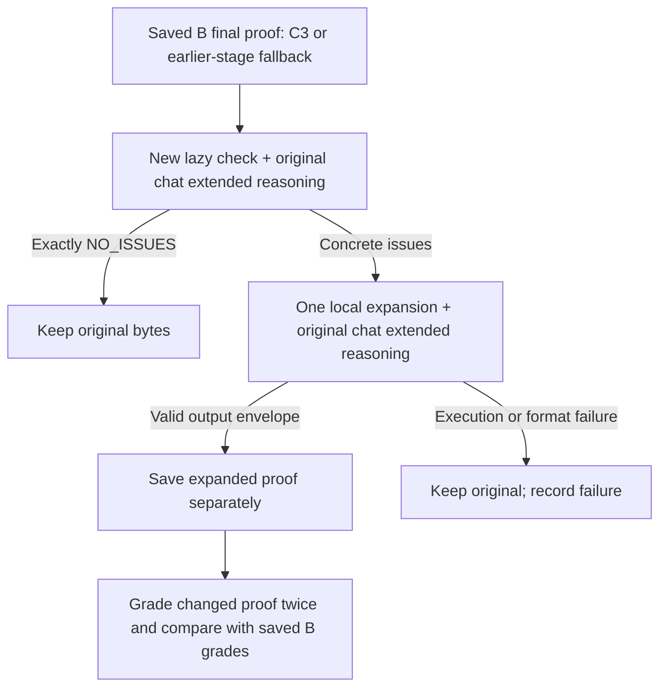

# One lazy check and conditional expansion of saved final proofs

This independent experiment reads the saved **B** proofs from the completed
[six-problem refinement comparison](../benchmarks/imo2026/results/refinement_bf_B6_selection_first_20260920_1426/README.md).
It applies new role-specific lazy-check and expansion instructions to every saved final proof,
using the **original chat extended reasoning mechanism**. It does not regenerate
raw proofs, replay refinements, modify the selector, or overwrite historical
proofs and grades. Improvement from this extra step has not yet been measured.
The existing harness's lazy-check and expansion prompts and behavior remain
unchanged; the new instructions are installed only inside this experiment's
separate worker processes.



The published B bank has **24 final proofs: 23 from C3 and one P3 candidate from
Refinement 1**. All 24 receive the new lazy check. A lane's last completed proof
is its final proof even when a later refinement did not complete, so C2, C1,
lazy-checked and raw fallback finals are also eligible. The original checkpoint
is retained as `source_stage`; only a concrete issue triggers expansion.
A prompt-routing or input-integrity violation fails the problem; it is not
silently counted as a successful no-issue check.

Module version 0.2.0 records `processing_scope: all_saved_final_proofs` in the
plan, worker jobs and summaries. The historical `post_c3_completion` filenames
and seed namespace remain stable. Older C3-only results can still be reported
under their original scope, but old job files cannot be executed by the new
worker. Use a fresh run directory for this expanded scope.

## New instructions

The exact strings are in
[`prompts.py`](../harnesses/post_c3_completion/prompts.py) and are recorded with
hashes in each worker's output.

The lazy checker receives only the proof, as in the existing frontend. For each
suspected omission it compares the **claim needed at that step** with **what the
written argument actually establishes**, checking hypotheses, quantifiers,
cases and scope. It must retain genuine omissions even when routine, withdraw
mistaken objections, and briefly identify the location and missing implication.
Only an issue-free report is exactly `NO_ISSUES`. The checker does not receive
saved scores, grader explanations, reference solutions or the original problem
as an additional input.

Expansion receives the original statement, proof and issue report. The frozen
repair-envelope prompt and parser remain intact. New user guidance and a
role-specific extended reasoning continuation ask it to **state and justify the exact claim
proved by each inserted argument**, then check that it supplies the needed step
without new assumptions or a weaker scope. It preserves valid material and
makes local edits. The original conclusion-preservation and justified-change
rules remain in effect. The envelope parser checks structure and declaration
consistency; it is not a mathematical proof verifier.

Both stages use **Gemma 4 31B**, with the existing BF16/MTP4 deployment. Qwen is
not called by this additional step. The original v257 chat extended reasoning preserves the
previous reasoning **and answer**, adds the role-specific continuation as a new
user instruction, and requests a complete replacement output. No native
thinking-prefix manipulation or second completion loop is introduced.

| Preserved setting | Lazy check | Expansion |
| --- | ---: | ---: |
| Initial output cap | 16,384 | 65,536 |
| Normal extended reasoning continuation cap | 32,768 | 65,536 |
| Temperature | 0.1 | 0.7 |
| top_p / top_k | 0.95 / 64 | 0.95 / 64 |
| Initial request timeout | 14,400 seconds | 14,400 seconds |
| Protocol attempts | 2 | 2 |

“One check and at most one expansion” describes **logical stages**. The original
mandatory extended reasoning continuation and existing protocol, cap and timeout recovery can
produce additional physical requests. Their behavior and limits are unchanged;
this experiment adds no new retry loop. Lazy checks run as a four-lane batch,
followed by a batch containing only candidates with issues.

The new stage has a recorded seed namespace
`post-c3-completion:<seed>:<problem-id>` (default seed 0). Each candidate's seed is
the first 32 bits of SHA-256 of `<namespace>:<candidate-id>`, replacing zero with
one. The original frontend then derives its lazy/expansion and recovery seeds.
This is a new completion stage, not a replay of the earlier refinement seed values.

## Run on the server

From the repository root, first update and run a model-free preflight for all
six problems. The published B proof bank is included in Git, so the original
server-only generation directory is not required.

```bash
git pull --ff-only
WORKSHOP_C3_CHECK="post_c3_check_$(date +%Y%m%d_%H%M%S)"

.venv-solver/bin/python -B scripts/run_post_c3_completion.py run \
  --source-arm B \
  --all \
  --output-dir ".workshop/experiments/$WORKSHOP_C3_CHECK"
```

A successful preflight reports `preflight_passed` and zero model calls. It loads
the real frozen frontend and verifies inputs without contacting model servers
or opening baseline grade files. Use a fresh output directory for actual
inference.

After the pinned Gemma server is ready, run:

```bash
WORKSHOP_C3_RUN="post_c3_B_$(date +%Y%m%d_%H%M%S)"
mkdir -p .workshop/experiments

nohup .venv-solver/bin/python -u -B scripts/run_post_c3_completion.py run \
  --source-arm B \
  --all \
  --output-dir ".workshop/experiments/$WORKSHOP_C3_RUN" \
  --execute-models \
  > ".workshop/experiments/$WORKSHOP_C3_RUN.log" 2>&1 < /dev/null &

echo $! > ".workshop/experiments/$WORKSHOP_C3_RUN.pid"
echo "Run: $WORKSHOP_C3_RUN"
tail -n 50 -F ".workshop/experiments/$WORKSHOP_C3_RUN.log"
```

To try one problem first, replace `--all` with `--problem-id imo2026_p4`.
Repeat `--problem-id` for a subset. **This experiment uses B as its baseline**;
the CLI accepts only `--source-arm B`.
The default Gemma endpoint is `http://127.0.0.1:8030/v1`.

Ctrl-C on `tail` stops only log viewing. To stop the experiment:

```bash
kill -TERM "$(cat ".workshop/experiments/$WORKSHOP_C3_RUN.pid")"
```

The parent terminates its own worker process group and records interruption;
it does not stop vLLM. There is no resume or overwrite mode. Do not edit the
experiment's code during a live run: code hashes are checked between workers.

## Outputs and separate grading

The experiment writes:

- `plan.json`, `inputs/`, `jobs/`, `status.json`: input snapshots, configuration,
  source/code hashes and overall progress.
- `logs/<problem>.log` and `problems/<problem>/`: original and new proofs,
  prompts, original model artifacts, extended reasoning audit records and per-lane outcomes.
- `grading/input_manifest.json`: **only changed proofs**, with opaque IDs and
  the existing grader configuration required for their two passes.
- `grading_key.json`: private mapping outside the grader's input directory.
- `REPORT.md`, `REPORT.json` and the CSV report: per-lane and problem comparisons.

Worker inputs are constructed from explicit statement/proof fields. The public
comparison sidecar also contains old scores; those fields are discarded during
input extraction and never passed to the generation worker or its models.
Baseline grade files are opened only by the separate reporting/export stage,
after generation has finished. Their proof, statement, rubric, reference and
model identities are checked before reuse.

**Do not regenerate or regrade B.** Unchanged outputs—including `NO_ISSUES` and
failed expansion fallbacks—reuse the existing two grades.
Only changed proof bytes require new grading. There can therefore be at most
**24 changed proofs × 2 passes = 48 new grades** for this published B bank.
A formatting-only byte change is also treated as changed, rather than silently
assuming score equivalence.

This runner does not launch a hosted grader. Give the changed-proof manifest to
the existing separate Strict Olympiad v2 grading workflow, with the recorded
model, reasoning effort, rubric and reference hashes. Preserve both grades and
raw grading evidence. The suite grader has a different input contract; do not
pass this directory directly to `grade_sampled_suite.py`.

Import grade records with schema `post-c3-grades-v1` and a `rows` array. Each row
contains `submission_id`, `pass_index` (1 or 2), `score` (integer 0–7),
`proof_file_sha256`, `model`, `reasoning_effort`, `policy_sha256` and
`reference_sha256`, matching the grading manifest. Then run:

```bash
.venv-solver/bin/python -B scripts/run_post_c3_completion.py report \
  --plan ".workshop/experiments/$WORKSHOP_C3_RUN/plan.json" \
  --grades /absolute/path/to/post_c3_two_pass_grades.json
```

With changed proofs awaiting grades, the report marks quality as pending and
makes no gain/loss claim. It compares each proof's two-pass mean, then the four
candidate means per problem. It also reports improved/unchanged/worsened
candidates, retention of baseline proofs that scored 7 in both passes,
processing eligibility, source checkpoints, failures and added elapsed time.
All candidates remain in the portfolio; proofs originally from C3 are also
reported as a separate source subgroup. The timings
measure the extra completion step, not a fresh end-to-end generation run.
