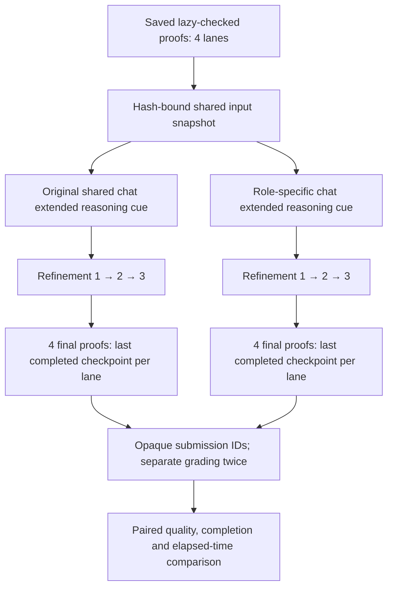

# Refinement continuation-wording experiment

This independent experiment tests whether role-specific continuation wording
improves the existing refinement workflow. It imports the frozen 1.7.0 engine
read-only, substitutes the continuation instruction in a fresh worker process,
and writes new results. It does not modify the generation harness, published
results or independent proof selector.

## Completed six-problem comparison

The [20 September B result archive](../benchmarks/imo2026/results/refinement_bf_B6_selection_first_20260920_1426/README.md)
contains all 24 role-specific-cue proofs, their 48 grades, and archived A evidence.
B averages **4.396/7** against **4.042/7** for A (**+0.354/7**); proofs receiving
7/7 in both passes increase from **5/24 to 8/24**. The archive includes the full
candidate matrix, individual grading explanations, hashes and a local verifier.

This completed run uses **archived A controls and the archived seed namespace**,
with fresh B refinements from the same lazy-checked proofs. It is a descriptive
historical-control comparison, distinct from the fresh alternating-arm workflow
described below. It carries no causal or statistical-significance claim. P3 has
one C1 fallback; independent selector results and subsequent P3 recovery are
excluded from this published snapshot.

## Question and controlled comparison

The two conditions differ only in the **chat extended reasoning continuation instruction**:

| Condition | Continuation |
| --- | --- |
| `original` | Original shared instruction, returned by the frozen engine unchanged |
| `role_specific` | A short instruction for the current reviewer, fusion, audit, repair-brief rewrite or resolver role |

Both retain the existing **reasoning + answer → new user instruction → complete
replacement response** behavior. This experiment does not use native
thinking-prefix extended reasoning, remove an end-of-thinking token, change the extended reasoning budget, or
apply the selector's multi-round selection procedure.



Each arm uses the same statement, exact four starting proof files, model roles,
system prompts, sampling settings, extended reasoning caps, recovery rules and original seed
calculation. The four lanes run concurrently within an arm; the arms run
sequentially on the existing two model servers. AB/BA order alternates across
problem/seed pairs, with the first order determined by the first seed. A single
pair cannot remove time/order effects; record server load and repeat if needed.

The shared seed namespace is
`refinement-bf-ablation:<pair-seed>:<problem-id>:r1`. This is a new paired
experiment, not a replay of the original suite's random generation seed.
Some original fusion, resolver and audit seeds include the **current proof
hash**. Once the two arms produce different proofs, their later physical call
seeds can differ under that same unchanged rule. Therefore this is a comparison
with **identical starting proofs and the same seed policy**, not a claim that
every corresponding later request has the same seed. Model responses and extended reasoning
records preserve the seeds for inspection. Conditional branches, retries and
actual token usage may also differ; configured budgets are held fixed, realized
compute is not matched.

## Role-specific instructions

The exact versioned strings are in
[`policy.py`](../harnesses/refinement_bf_ablation/policy.py) and copied into each
experiment plan. Their focus is:

| Role | Reconsideration focus |
| --- | --- |
| Reviewer 1 — Gemma | Earliest unsupported inference; distinguish routine omissions from substantive gaps |
| Reviewer 2 — Qwen | Validate a counterexample against all hypotheses; try to refute the objection |
| Reviewer 3 — Gemma | Charitable reading versus an unproved nontrivial repair |
| Fusion/reconsideration — Gemma | Resolve conflicting diagnoses against the proof; make repair obligations viable |
| Acceptance audit — Qwen | Independently check the accepted proof's decisive implications |
| Repair-brief audit — Qwen | Check whether the proposed repair is viable and noncircular |
| Repair-brief rewrite — Qwen | Revise the repair plan around the actual unresolved obligation |
| Resolver — Gemma | Produce a complete revised proof that actually resolves valid criticisms |

Every role-specific instruction ends with a requirement to emit a complete
replacement in the original output format. The system prompt still defines that
format. The new instructions are 71–81 whitespace-separated words each; the
original general text instruction has 43. Extractor and gap-selector auxiliary calls keep the original generic
cue. Routing requires both an explicit stage pattern and the exact loaded
system-prompt hash; an unknown combination fails the arm rather than silently
using a different policy. The original arm uses the same routing checks.

## Pilot on the server

Start with **one problem, all four lanes and one paired seed**. P2 is a useful
first diagnostic because a previous change to extended reasoning affected its score, but
that makes it an exploratory, deliberately selected case. It cannot establish
general improvement. Predeclare further problems/seeds before examining their
results; do not expand only on favorable cases.

From the repository root, first perform an offline preflight. The source path
must be the native `generation/run` directory on the original server, with four
completed lazy-check producers. It may contain later refinement results; this
experiment only reads the lazy-check starting proofs and their receipts.

```bash
git pull --ff-only

WORKSHOP_BF_SOURCE="benchmarks/imo2026/results/suite_e2e_20260919_142752/generation/run"
WORKSHOP_BF_CHECK="bf_cues_check_$(date +%Y%m%d_%H%M%S)"

.venv-solver/bin/python -B scripts/run_refinement_bf_ablation.py run \
  --source-run "$WORKSHOP_BF_SOURCE" \
  --problem-id imo2026_p2 \
  --pair-seed 0 \
  --output-dir ".workshop/experiments/$WORKSHOP_BF_CHECK"
```

Without `--execute-models`, both workers load and verify the real frozen engine,
validate the four input bindings, and prepare cases **without contacting model
servers or generating proofs**. A successful result is `preflight_passed`, not
an inference or mathematical-correctness result. Use a fresh output directory
for the actual run.

When the existing Gemma/Qwen servers are ready, run the pilot in the background.
Do not run another GPU workload concurrently if you want interpretable timings.
Live preflight checks the pinned local model deployments; default endpoints are
Gemma `http://127.0.0.1:8030/v1` and Qwen `http://127.0.0.1:8027/v1`.

```bash
WORKSHOP_BF_RUN="bf_cues_p2_$(date +%Y%m%d_%H%M%S)"
mkdir -p .workshop/experiments

nohup .venv-solver/bin/python -u -B scripts/run_refinement_bf_ablation.py run \
  --source-run "$WORKSHOP_BF_SOURCE" \
  --problem-id imo2026_p2 \
  --pair-seed 0 \
  --output-dir ".workshop/experiments/$WORKSHOP_BF_RUN" \
  --execute-models \
  > ".workshop/experiments/$WORKSHOP_BF_RUN.log" 2>&1 < /dev/null &

echo $! > ".workshop/experiments/$WORKSHOP_BF_RUN.pid"
echo "Run: $WORKSHOP_BF_RUN"
tail -n 50 -F ".workshop/experiments/$WORKSHOP_BF_RUN.log"
```

Ctrl-C on `tail` only stops watching the log. To stop the experiment itself:

```bash
kill -TERM "$(cat ".workshop/experiments/$WORKSHOP_BF_RUN.pid")"
```

The parent forwards termination to its own worker process group and records
`interrupted`; it leaves the model servers running. No resume or output-directory
overwrite is supported. Start a new paired experiment after interruption.

Repeat `--problem-id` to add problems, `--source-run` to include runs from other
benchmarks, and `--pair-seed` to test more seed namespaces. Selection is explicit;
this module does not randomly pick problems. For example, add
`--problem-id imo2026_p1 --pair-seed 1` to compare P1 and P2 at seeds 0 and 1.
Each problem/seed pair produces eight final proofs and needs 16 grade records
for two-pass evaluation.

## Saved outputs and grading

Everything is under `.workshop/experiments/<run>/`:

- `plan.json`: source/code hashes, paired settings, exact treatment cues and arm order.
- `inputs/`: shared statement manifest and exact copies of the four starting proofs.
- `jobs/`, `logs/`, `status.json`: per-arm configuration, progress and parent outcome.
- `pairs/<problem>__seed<N>/<variant>/`: original intermediate artifacts,
  `continuations.jsonl`, final `proofs/`, checkpoint timings and `summary.json`.
- `grading/input_manifest.json`, `grading/proofs/`, `grading/problems/`: opaque-ID
  proof copies and statements for separate grading, without arm labels.
- `grading_key.json`: private mapping from opaque submissions to arms and lanes;
  keep this outside the grader's inputs.
- `REPORT.md` and `REPORT.json`: completion, fallback and runtime results;
  quality remains pending until grades are imported.

The hash/receipt checks bind input and output files to their recorded producers;
they do not verify mathematical correctness, and input loading does not replay
every raw HTTP response. A lane that fails C3 submits C2; a failure at C2 submits
C1; a failure at C1 submits the lazy-checked proof. Other lanes continue. All four
final proofs remain in the comparison. An integrity/routing error or user
interruption fails the arm and blocks a complete paired quality report.

Grading is separate and **not automatically called**. Use Strict Olympiad v2 for
IMO and IMOBench B.5 for ProofBench, with two independent grading invocations per
proof using the same evaluator configuration across arms. These are repeated
automated judgments; they do not eliminate shared evaluator errors. The existing
`grade_sampled_suite.py` takes a different input contract and must not be pointed
directly at this experiment directory.

The grading manifest gives the exact protocol identifier and proof-file hash
for each submission. Collect results into:

```json
{
  "schema": "refinement-bf-grades-v1",
  "rows": [
    {
      "submission_id": "<opaque ID from grading/input_manifest.json>",
      "pass_index": 1,
      "score": 0,
      "proof_file_sha256": "<exact SHA-256 from grading manifest>",
      "grader_model": "<evaluator model and configuration>",
      "protocol": "<protocol from grading manifest>"
    }
  ]
}
```

The example row is a format placeholder, not an experimental result. Supply
passes 1 and 2 for every submission, with integer scores from 0 to 7. Import:

```bash
.venv-solver/bin/python -B scripts/run_refinement_bf_ablation.py report \
  --plan ".workshop/experiments/$WORKSHOP_BF_RUN/plan.json" \
  --grades /absolute/path/to/two_pass_grades.json
```

The primary comparison averages the two grades of each proof, then averages the
four lanes for each problem/seed pair, and reports role-specific minus original.
Also report both-pass 7/7 rates, grading disagreements, C3 completion, fallback
stages and elapsed time. Multiple seeds of the same problem are repeated
measurements; they are not additional independent problems. A one-problem pilot
is descriptive and carries no statistical-significance claim.

Time here covers **refinement only**, with four concurrent lanes and arm-local
setup/export. It excludes original raw/lazy generation and separate grading.
Lane durations overlap and must not be summed as problem wall time. Extended reasoning JSONL
records are logical continuation events, not an exact count of all physical
requests; retries and recovery can add requests. Raw model artifacts are kept
for later token/cost analysis. The initial report does not claim complete
physical-call or token accounting.
