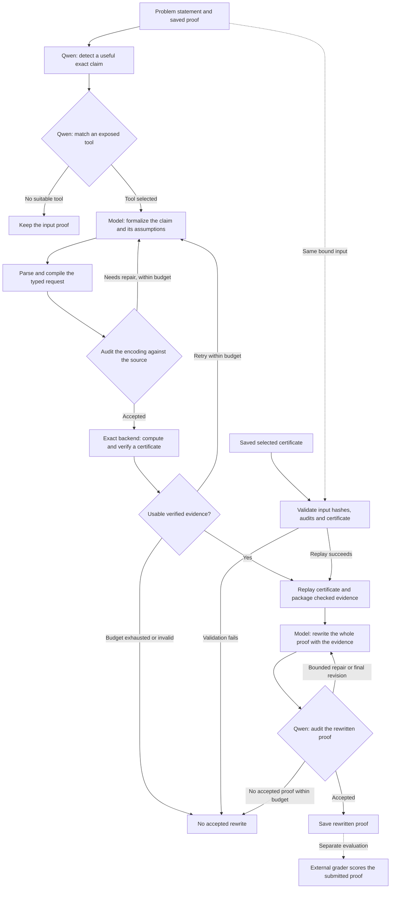

# Workshop Tools — experimental

Workshop Tools is an opt-in extension to Proof Workshop. The core pipeline
runs independently of this directory. Saved tool results appear in the separate
[experimental score matrices](../../docs/public_release_report.md#experimental-tool-call-results).
The core matrices exclude them. Saved proofs, grades and certificate evidence
are retained.

The extension identifies a claim in a saved proof, attempts formalization,
runs an exact backend, and supplies checked evidence to proof rewriting.
Supported methods include algebraic identities, geometry, real-root reasoning
and discrete certificates. A successful certificate supports its specified
claim; it does not certify the entire natural-language proof.

## Experimental workflow



Fresh runs perform detection, matching and bounded formalization attempts.
The first qualifying certificate is selected for proof synthesis. Semantic
audits check whether the formal request represents the source claim; exact
backends check the supplied mathematical statement under its recorded
conditions. Proof writing and whole-proof audits remain model calls, with
mandatory extended reasoning. Backend verification itself makes no model calls.
An internal audit pass does not guarantee a high external score.

Saved-certificate regeneration enters through the replay branch. It checks
the original input bindings and evidence, then reruns proof writing and audits;
it does not repeat detection or certificate search. Several reported trials
use this route. External grades and reference solutions are evaluation inputs,
not inputs to the fresh solver workflow or certificate replay.

## Exposed tools

The current automatic matcher exposes these **six operations**. The names are
the actual allowlist in
[proof_harness.py](runtime/cognitive_well_harness_v0_3_356_v349_discrete_consolidation_20260917/proof_harness.py).
Models choose the operation and supply a typed mathematical request; these
are bounded interfaces rather than a general Python or shell interpreter.

| Exposed operation | What it can establish | Input limits and obligations |
|---|---|---|
| `polynomial_ideal_membership` | A polynomial consequence of supplied equations, with an explicit certificate. | Polynomial relations, target and justified nonzero guards; the model must connect them to the theorem. |
| `exact_geometry` | Algebraic consequences of planar constructions, including incidence, circle and distance relations. | Typed Cartesian constructions and real-domain conditions; orientation, denominator and degeneracy conditions remain explicit. |
| `rational_identity` | Rational identities and scalar algebraic consequences. | Exact scalar definitions and justified denominator conditions; a conditional identity does not prove the surrounding theorem. |
| `real_root_classification` | All roots, or stationary points and derivative signs, for a supported univariate expression on an exact finite interval. | Polynomial, rational or one positive square-root expression; no free parameters or transcendental functions. Singularities and square-root branches must be handled. |
| `uniform_partition_count` | A partition-incidence lower bound on nonnegative subset sums. | N labeled real weights with nonnegative total and positive K dividing N; the model derives the normalization and connects the bound to the problem. |
| `symbolic_modular_order` | Divisibility for infinite exponent families from checked polynomial congruences. | A model-supplied integer-polynomial modulus, bases, inverses, offsets and residue; selecting them and proving any surrounding convergence argument remain model work. |

**Exact backends:** SymPy provides exact algebra, polynomial manipulation,
root isolation and discrete arithmetic. Algebraic/geometry routes also use
Singular for polynomial certificate search and Z3 for supported real-domain
checks. Polynomial division, guarded radical membership, Laurent reduction,
guard checking and certificate replay are internal backend steps, not additional
matcher operations. The polynomial exporter converts verified algebra into
evidence for the proof writer; it does not certify an entire proof.

The [per-proof results](../../docs/public_release_report.md#experimental-tool-call-results)
name the operation used in every reported trial. ProofBench uses IMOBench B.5;
IMO P2 uses the lower of two strict-v2 grades for each input and rewrite.
The trials span historical implementations; the exposed menu here describes the
current runtime, not a claim that every old trial used the identical exporter.

## Run on a saved proof

Install the [solver environment](../../docs/local_reproduction.md) and start
the local Gemma and Qwen servers. From the repository root:

```bash
.venv-solver/bin/python -B experiments/workshop_tools/run.py \
  --problem-file benchmarks/imo-proofbench/basic/problems/PB-Basic-009.json \
  --proof-file /absolute/path/to/basic009_proof.md \
  --output-dir /absolute/path/to/new_tool_run \
  --master-seed 20260915 \
  --gemma-endpoint http://127.0.0.1:8030/v1 \
  --qwen-endpoint http://127.0.0.1:8027/v1 \
  --execute-models
```

Use a fresh output directory. Omitting `--execute-models` prepares the tool
plan without model calls. To regenerate from an originally selected certificate:

```bash
.venv-solver/bin/python -B experiments/workshop_tools/run.py \
  --resume-selected-certificate-from /absolute/path/to/source_native_run \
  --problem-file benchmarks/imo-proofbench/basic/problems/PB-Basic-009.json \
  --proof-file /absolute/path/to/basic009_proof.md \
  --output-dir /absolute/path/to/new_regeneration \
  --execute-models
```

This mode retains the source run's settings, replays its bound certificate and
reruns synthesis without repeating detection, matching or certificate search.
Saved-run paths and hashes must remain valid.

## Dependencies and integrity

The current runtime and its imported dependencies are bundled under `runtime/`.
The recorded implementation ID is `0.3.356`; older standalone tool versions
are no longer launch options. Required internal module names are preserved
to avoid altering imports, prompts, seeds or mathematical behavior.
[The inventory](runtime_inventory.json) pins every bundled file.
Its `excluded_reference_files` records the path and hash of an omitted external
grading reference separately. The reference body is not a shipped runtime
dependency and is not supplied to the tool workflow. Archived grading manifests
may still name it as historical provenance.

```bash
python3 -B experiments/workshop_tools/run.py --verify
```

SymPy and Z3 are pinned in the solver requirements. Geometry certificate search
also requires Singular 4.2.1 with its libraries. The unchanged runtime expects
`runtime/.tools/singular-4.2.1/root/usr/bin/Singular` and the wrapper
`runtime/.tools/singular-4.2.1/singular`. Install these locally; executables and
serving environments are not distributed. Tool families with unavailable
optional backends cannot be assumed to work from Python dependencies alone.

[Saved-certificate results](saved_certificate_results.md) describe the recorded
trials. They are targeted experiments, not a uniform benchmark run or a
guarantee of future model scores. External grading remains separate.
