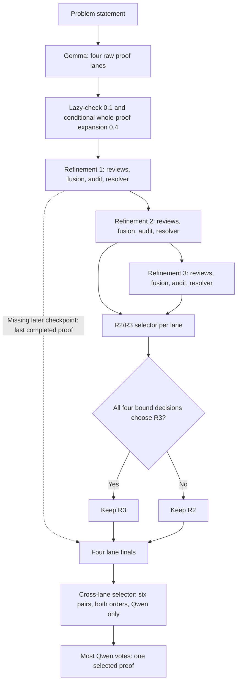

# Workshop Pipeline

Workshop Pipeline is the composite harness in **TrinitySM**. It takes a
problem statement, generates four candidate proofs, checks and refines the
initial candidates, then runs review and revision cycles. The released solver
uses Gemma 4 and Qwen. External grading runs separately.

**Default harness: [B (1.12.0)](../../docs/harness_b_selection.md)**, with original lazy-check/whole-proof expansion at 0.1/0.4, B refinement extended reasoning, a Gemma/Qwen audit of R2 versus R3 in both orders, and a [cross-lane voter](../../docs/cross_lane_voter.md) that selects one of the audited finals. Earlier A/B engines remain available through the [release registry](../imo_proof_pipeline/releases/index.json). Historical benchmark tables retain their original run identities.

## Overview

**TrinitySM** is a modular research system for generating and improving
mathematical proofs from problem statements. **Workshop Pipeline**, the composite harness, connects
**Workshop Draft** for initial proof generation and checking with **Workshop
Refine** for repeated review and revision. The recorded setup uses Gemma 4 and
Qwen, with separate automated grading of the submitted proofs by
**gpt-5.6-sol / xhigh**.

**TrinitySM 0.1.0-rc.1** is the first public release candidate. It includes
the full statement-to-proof workflow, the current implementation, benchmark
statements, generated proofs and a portable evaluation
report. **Workshop Tools** is an experimental extension for selected claims.
The core pipeline runs with tool calls disabled.

The public project version is separate from the bundled frozen engine:

| Identity | Version |
|---|---|
| TrinitySM public release candidate | `0.1.0-rc.1` |
| Default frozen engine (`implementation_release`) | **B `1.12.0`** |
| Historical benchmarks | Original recorded versions and run identifiers |

`--version` reports the public project version; `--verify` shows both identities
and their hashes. `--release` selects the frozen engine. The project version is
recorded in [project.json](../../project.json).



The R2/R3 selector uses **Gemma and Qwen in two independent presentation orders** (four calls per eligible lane). R3 replaces R2 only when all four bound, unambiguous decisions choose it. Missing R3 falls back to R2; missing later checkpoints fall back to R1, then expanded/raw proof. Identical R2/R3 proofs do not need comparison calls.

For new runs, the cross-lane selector runs **12 Qwen comparisons: 6 unordered lane pairs × 2 presentation orders**, with **12 concurrent calls**. Every call chooses one proof. The highest Qwen vote total wins; ties use the recorded seed-derived lane order. Both selectors see problem statements and proofs, never grading references or external scores. Runs capture their final-selector policy and retain it on resume.

- **Four candidate lanes:** two raw-generation temperatures, with two seeded
  candidates each: `t10_r01`, `t10_r02`, `t07_r01`, and `t07_r02`.
- **Review and revision:** lazy checking, conditional refinement, multiple
  reviewers, review fusion, and resolver cycles. Saved checkpoints expose how
  the proof changes during the run.
- **Separate automated evaluation:** the launcher supplies problem statements
  to the solver. Subsequent stages use candidate proofs and internal reviews.
  Evaluation reference solutions, per-problem grading guidelines and external grades are not supplied
  by the generation path. Internal reviews use qualitative mathematical verdicts;
  the launcher never starts the external grader.
- **Recorded experiments:** frozen source inventories, seeds, prompts, model
  settings, proof hashes and experiment manifests identify each run.

Extended reasoning and bounded recovery are part of the recorded generation policy.
The B 1.12.0 workflow is **Draft → Refinement 1 → Refinement 2 → Refinement 3 → R2/R3 selection → four lane finals → cross-lane selection → one submitted proof**. Earlier completed checkpoints remain eligible under the recorded fallback policy. Each refinement pass includes review, fusion, auditing and revision. The two final selectors compare saved proofs without rewriting them.

| Harness | Role | Release role |
|---|---|---|
| **Workshop Pipeline** | Composite statement-to-proof workflow | Core |
| **Workshop Draft** | Four candidates, lazy checking and conditional expansion | Core module |
| **Workshop Refine** | Reviews, fusion, repair-brief audits and proof revision | Core module |
| **Workshop Tools** | Claim formalization, exact checks and proof rewriting | Experimental extension |

The [module guide](../modules/README.md) maps the names to their recorded
implementations. Historical version IDs remain in reproduction commands and
manifests; the names do not change the solver or its saved results.

## What drives the approach

**Extended reasoning, complementary Gemma and Qwen roles, and structured review
are the core of TrinitySM.** The reported benchmark results come from
generating four candidate proofs and repeatedly examining and revising them
through the complete harness.

- **Extended reasoning:** the recorded policy requires an additional reasoning
  continuation, including after an initial response ends, and asks for a complete
  replacement response. Token limits and bounded recovery control this extra work.
- **Gemma + Qwen:** Gemma 4 31B generates and revises proofs and supplies two
  reviewer perspectives. Qwen3.6 27B supplies another review and audits the
  proposed acceptance or repair, bringing a second model into the checking loop.
- **Reviews → fusion → audit → revision:** separate reviews identify weaknesses;
  Gemma fuses their findings; Qwen audits the resulting decision or repair brief;
  the harness routes accepted findings into proof revision. Three refinement
  passes build on each lane's preceding proof.

**Small controlled tests showed different strengths in diagnosis and repair,
motivating our use of Gemma and Qwen together.** We designed the harness around
this observation: Gemma generates and revises proofs, while Qwen contributes
complementary reviews and audits. The [mixed-model rationale](../../docs/mixed_model_rationale.md)
describes the experiments that informed this design and the larger-scale
ablation needed to assess its generality.

The [ablation study](../../docs/public_release_report.md#ablation-study--imo-proofbench) compares saved raw
generation without and with extended reasoning against the full harness. It does
not isolate the contributions of individual review, fusion or audit stages.

Workshop Draft adapts the **multi-persona dialectic prompting** in v2, Appendix F.2
of Dang et al.'s [*Escaping the Cognitive Well: Efficient Competition Math with
Off-the-Shelf Models*](https://arxiv.org/abs/2602.16793v2). Gemma's drafting prompt
assigns strategy proposals, skeptical critique, deductive checking and final
synthesis to named roles. It asks them to challenge and revise the argument;
the lazy-check stage then flags omitted derivations for explicit expansion.
The [implementation mapping](../../docs/sources.md#cognitive-well-ideas-used-in-workshop-draft)
identifies the prompts and call sites behind this attribution.

## Modules

| Module | Role | Input → output |
|---|---|---|
| **Workshop Draft** | Generation, lazy checking and conditional expansion | Problem statement → four checked candidate proofs |
| **Workshop Refine** | Independent reviews, fusion, repair-brief auditing and revision | Candidate proofs → revised proofs and cycle checkpoints |
| **Workshop Tools — experimental** | Claim matching, formalization, exact checks and proof rewriting | A selected proof → a rewrite using checked evidence, when successful |

The [module guide](../modules/README.md) maps these public names to their
recorded implementations. Workshop Pipeline composes Draft and Refine. Tools
requires an explicit opt-in and is not part of the default pipeline.

## Inspect a release

```bash
python3 -B harnesses/proof_workshop/run.py --help
python3 -B harnesses/proof_workshop/run.py --version
python3 -B harnesses/proof_workshop/run.py --list-releases
python3 -B harnesses/proof_workshop/run.py --release 1.12.0 --verify
```

The public CLI identifies itself as **Workshop Pipeline**. `--help` lists all
supported options, including `--release`, the three execution modes
(`--dry-run`, `--execute-models`, `--collect-only`), problem selection, local
server settings, seed settings and resume controls. Generation requires a
statement-only `--problem-dir` and an `--output-dir`. Collection uses the saved
configuration and accepts `--output-dir` plus an optional `--release`.

`--version` prints **TrinitySM 0.1.0-rc.1**, the public project version
recorded in [project.json](../../project.json). `--verify` prints detailed JSON:

```json
{
  "name": "TrinitySM",
  "version": "0.1.0-rc.1",
  "component": "Workshop Pipeline",
  "implementation_release": "1.12.0"
}
```

The full verification output also includes project, controller, profile and
engine hashes, upstream provenance and the three refinement stages. Both
commands verify the frozen engine inventory. `--release` selects that engine;
it does not select a public project version. `--list-releases` prints one
bundled engine version per line. Recorded upstream identifiers remain unchanged.
Omitted runtime settings keep the pinned implementation's defaults; public
naming does not change the seed namespace.

The official public workflow is **Draft → Refinement 1 → Refinement 2 →
Refinement 3 → replacement audit → cross-lane vote → final proofs**. Harness B, implementation 1.12.0, is the default; earlier registered A/B engines remain explicitly selectable with `--release VERSION` for historical replay.
See [the exact current B policy and evidence](../../docs/harness_b_selection.md). The public
controller runs up to three refinement passes and exports each lane's last
eligible completed proof, when available. If execution stops early, completed proofs
from earlier stages remain eligible for submission. Each pass includes reviews,
fusion, audit and proof revision; there are no additional resolver stages.

For 1.12.0, changed R3 proofs are eligible only after Gemma and Qwen each approve
in both independent presentation orders. The four bound explicit raw decisions
control this choice; body-consistency checks are saved as diagnostics. Otherwise the completed R2 proof is
submitted. Identical R2/R3 text skips audit calls. Audit failures preserve R2;
all candidate and audit artifacts remain available.

Within one controller, problems run sequentially: each problem attempts the refinement passes before
the next problem starts drafting. Each candidate submits its last eligible completed
proof in this order: **Refinement 3 → Refinement 2 → Refinement 1 → lazy-checked
→ raw**. An ordinary refinement failure preserves that candidate's earlier
proof and the queue continues. Candidates are independent: a completed C2
candidate still attempts C3 even if another candidate failed earlier. Candidates
without a completed C2 proof keep their own last completed proof.
User interruption still stops generation. A candidate with no completed proof
is explicitly missing, never counted as a successful submission.
The run's `problem_sequence.json` records this scheduling policy and progress;
the frozen inner-engine records still end at R1-C2, with the third pass stored
under `finalization/<problem>/<candidate>/`.

`final_results.json` distinguishes a completed submission from a fully refined
proof. Runs with valid earlier-stage submissions use `completed_with_fallbacks`;
each lane records its actual `selected_stage`, `fallback_used`, and failure
reason. `completed_proofs`, `fully_refined_proofs`, and `fallback_proofs` are
separate counts. A valid fallback does not fail the benchmark or prevent the
sampled suite from advancing. No completed proof for a lane, export failure,
or a user interruption still produces a nonzero exit. Final collection never
retries a C3 call already attempted by the per-problem scheduler.

An already running controller keeps the schedule it loaded at startup. Changing
its schedule requires a restart at a completed problem boundary. Resume uses
the original run arguments and reuses completed C2 and C3 artifacts; it does
not rerun completed model stages or silently restart partial refinements.
If a stopped run already exported earlier proofs, an explicit resume archives
those proofs and their receipt under `proof_history/` before publishing a later
completed stage. Modified or unbound published files are never replaced.

Use the [root setup and run instructions](../../README.md) for benchmark runs.
For one 96 GB GPU, use the [sleep/wake runner](../single_gpu/README.md), which
starts one controller per problem and batches ready calls by model across them.
`benchmarks/run_experiment.py` records the environment and invokes the pinned
composite. For custom statement-only inputs:

```bash
python -B harnesses/proof_workshop/run.py --release 1.12.0 \
  --problem-dir /absolute/path/to/statement_only_inputs \
  --output-dir /absolute/path/to/new_run \
  --dry-run
```

Each input JSON contains `problem_id` and `problem` (or `claim`). Use a fresh
output directory. Replace `--dry-run` with `--execute-models` for inference after
configuring the recorded model servers. This launcher never starts grading.

## Names and version identity

The public controller composes the pinned generation engine with its existing
final-pass driver. It writes `final_results.json` and exports completed proofs
to `proofs/<problem>/<candidate>.md`. The receipt records controller, driver and
implementation hashes. Source-bound intermediate records remain available for
auditing; the public stages are named `refinement_1`, `refinement_2` and
`refinement_3`.

New preflight and final-result receipts record `project_version: 0.1.0-rc.1`
separately from `implementation_release: 1.12.0`. Existing benchmark records keep
their original versions, run names, checkpoint identifiers and hashes.

If execution stops, the last eligible completed proof in each lane is its final
submission: Refinement 3 → 2 → 1 → lazy-checked → raw. Completion records and
hashes exclude unfinished outputs. `final_results.json` records the selected
stage and interruption cause; a usable proof does not turn a failed run into a
successful run. After a hard kill, `run.py --collect-only --output-dir <run>`
performs the same export without inference. See
[interrupted runs](../../docs/local_reproduction.md#interrupted-runs).

Historical native manifests, seed namespaces and source paths retain their
original identifiers so existing proof bindings and replay checks remain valid.
B 1.8.0 introduced role-specific refinement continuation cues. B 1.12.0 also uses original expansion at 0.4 and audits R2/R3 replacements; public naming does not change seeds.
Versioned implementation storage remains under
[imo_proof_pipeline](../imo_proof_pipeline/README.md). Experimental tool versions
have separate identities and do not define the composite's version.

[Evaluation report](../../docs/public_release_report.md) ·
[Experimental tools](../../experiments/workshop_tools/README.md) ·
[Environment](../../ENVIRONMENT.md)

The public copy sanitizes private locations and recomputes affected checksums.
See [sanitization provenance](../../docs/reproduction/sanitization.md) for the
relationship to the original research artifacts.

For B 1.12.0, the [cross-lane voter](../../docs/cross_lane_voter.md) selects one audited lane final per problem. All lane proofs remain in `proofs/`; `final_results.json` also records `problem_selections`, the separate winner proof path, full votes and order-disagreement rates.
